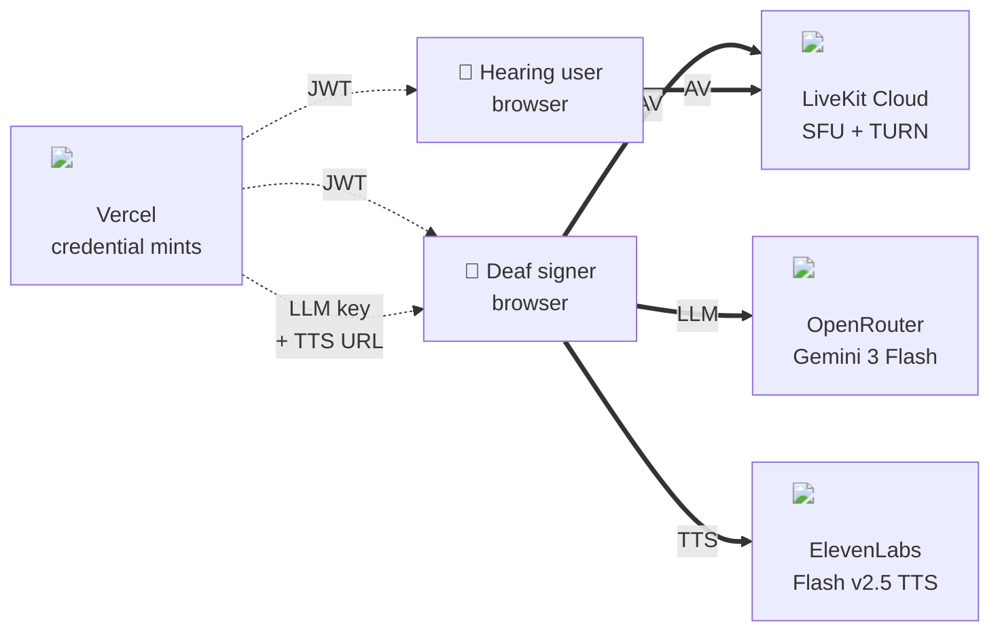
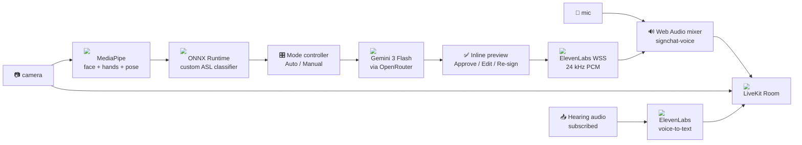
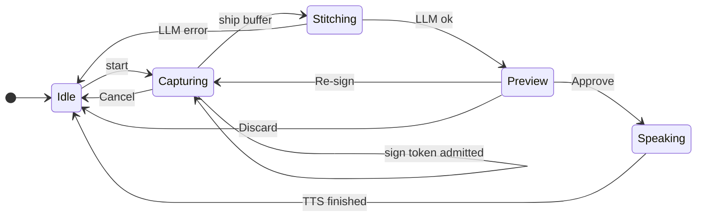

# Signchat Architecture

**Status:** authoritative
**Region pin:** Vercel `pdx1`, LiveKit Cloud us-west PoP
**Latency target:** sign-end → first audible byte at the Hearing user — p50 ~0.6 s, p95 ~0.9 s
**Reliability stance:** no fallbacks. A turn either succeeds through the primary path or surfaces a clear error and is re-committed by the signer.
**Backend stance:** no long-running backend. Vercel hosts the website and short-lived credential-mint API routes; LiveKit Cloud, OpenRouter, and ElevenLabs handle every per-turn data path.

---

## 1. Overview

Signchat is a 1:1 real-time video chat between a **Deaf signer** and a **Hearing user**. The signer's browser owns the entire sign-to-voice turn:

- MediaPipe Tasks Vision extracts hand + face + pose landmarks from the local outgoing camera track.
- An `onnxruntime-web` session classifies sliding windows of those landmarks against a custom ASL classifier model.
- The accumulated tokens plus a rolling Hearing transcript context are sent **browser-direct** to OpenRouter, which returns one casual English sentence as JSON.
- The signer reviews the sentence inline (Approve / Edit / Re-sign / Discard).
- On Approve, the browser opens a streaming WSS to ElevenLabs Flash v2.5, decodes the returned 24 kHz PCM, and mixes it with the live microphone in a Web Audio graph.
- The mixed audio is published to LiveKit as one persistent `signchat-voice` track that the Hearing user subscribes to as if it were a normal voice channel.

The reverse direction — Hearing voice → Deaf captions — is reached **browser-direct** from the Deaf side: the Deaf browser subscribes to the Hearing user's remote audio track, streams it to ElevenLabs voice-to-text, and broadcasts the streaming partials back to the Hearing user over the LiveKit data channel. Both tiles render live captions of the speaker on that tile in real time.

Vercel is **not** on the per-turn data path. It mints three short-lived credentials at room-join — a LiveKit JWT, a credit-capped OpenRouter session key, and an ElevenLabs signed WSS URL — and otherwise serves static assets. There is no server-side LiveKit bot, no TTS relay, no WebSocket gateway.

---

## 2. Goals and non-goals

**Goals.**

- Two browsers in different cities join a `signchat.org/room/<id>` link, see each other's video, and the Deaf signer's responses are reconstructed into spoken English audible to the Hearing user as if it were the signer's own voice.
- The sign classifier runs on the Deaf signer's local camera track before any LiveKit publish, so latency is bounded by the LLM and TTS calls — not by an extra encode/decode round-trip.
- Every per-turn third-party call (OpenRouter, ElevenLabs) originates from the Deaf signer's browser using bounded credentials minted by Vercel.
- Both video tiles show live captions in real time: word-by-word streaming partials on the Hearing tile, full reconstructed sentence pinned to the Deaf tile in sync with the synthetic voice.
- The system is forward-compatible with a future Electron "Bridge" app that routes the same mixed audio into a virtual mic (BlackHole / VB-CABLE) for use with FaceTime / Zoom / Meet.

**Non-goals.**

- Group calls (>2 participants).
- Persistent transcripts, accounts, history search.
- Mobile native apps.
- Production-grade abuse / compliance controls beyond rate-limited credential mints.
- Server-side recording, mixing, or analytics.

---

## 3. System diagram

The whole system is six actors: two browsers, one Vercel (credential mints only), and three third-party providers. Solid `==>` arrows are per-turn provider streams; dashed `-.->` arrows are one-shot credential mints at room-join.



What runs inside the Deaf browser — MediaPipe + ONNX classifier, the mode controller, the inline preview, the Web Audio `signchat-voice` mixer, ElevenLabs voice-to-text for the Hearing user's captions — is described in §5 (component reference) and §8 (audio pipeline). The Hearing browser is much simpler: it publishes camera + mic and renders incoming captions.

### 3.1 Inside the Deaf browser



The signing direction is the top row. The captioning direction (Hearing voice → ElevenLabs voice-to-text → DataChannel) is the bottom row. Everything in this diagram runs in one browser tab.

---

## 4. Repository layout

```
apps/
  web/                         Next.js 16 application + API routes
packages/
  contracts/                   Shared TypeScript types (RoomDataMessage, StitchResponse, etc.)
  sign-pipeline/               MediaPipe wiring + ONNX classifier loader + vocabulary + dictionary + combos
  prompts/                     Single source of truth for prompt assembly
tools/
  prompt-lab/                  Standalone CLI prompt benchmark; imports from packages/prompts + sign-pipeline
```

`packages/sign-pipeline` and `packages/prompts` are browser-first. They are consumed by `apps/web` today and by the Bridge Electron app described in §16.

Workspace tooling: `pnpm` with workspace protocol, `pnpm -w typecheck && pnpm -w lint && pnpm -w build` from the monorepo root.

**Web UI tokens.** `apps/web/app/globals.css` is the committed single source of truth for `--sc-*` (app-wide) and `--sh-*` (marketing hero header only). A human-readable map of landing composition, nav/dropdown behaviour, CTAs, glass panels, and motion lives in **`apps/web/DESIGN_SYSTEM.md`**.

---

## 5. Service inventory

### 5.1 Web app + REST API — `apps/web` on Vercel `pdx1`

- Next.js 16.2.4, React 19.2.5, TypeScript 5.9.3, Tailwind CSS 4.2.2.
- Hosts the marketing landing, the room shell at `/room/[id]`, and the credential-mint API routes listed in §10.
- All API routes run on the Node.js runtime; secrets are read from Vercel project env vars on every cold start (§9).
- No persistent connections, no database, no scheduled jobs.

### 5.2 Transport — LiveKit Cloud

- `livekit-client@2.15.10` in the browser; `livekit-server-sdk@2.15.0` in `/api/livekit/token`.
- Managed SFU + TURN; us-west PoP auto-selected via anycast.
- Each participant publishes:
  - **Hearing user:** camera + microphone (standard tracks).
  - **Deaf signer:** camera + one `signchat-voice` audio track that is a Web Audio mix of the live mic and decoded TTS PCM (§8). The raw mic is **not** published separately.
- DataChannel carries `caption`, `transcript_partial`, and `chat` messages (§11.4).

### 5.3 Sign capture — MediaPipe Tasks Vision

- `@mediapipe/tasks-vision@0.10.17`. WASM bundle + `.task` model assets loaded from `cdn.jsdelivr.net` and `storage.googleapis.com`.
- Three detectors per tick: `FaceLandmarker` (468 landmarks), `GestureRecognizer` (21 hand landmarks × 2 hands + handedness), `PoseLandmarker` (33 body landmarks).
- Runs on the **main thread**, fed by an `<HTMLVideoElement>` backed by the Deaf user's local `Track.Source.Camera` MediaStreamTrack — captured *before* the LiveKit publish path so no encoder latency is in the loop.
- **Lifecycle.** Boots once on room-join (after the lobby hands off to the LiveKit connect block) and runs continuously for the lifetime of the call regardless of view mode. Auto-mode silence detection requires the loop to be hot.
- The Hearing browser never instantiates MediaPipe.

### 5.4 Sign classification — onnxruntime-web

- `onnxruntime-web@1.20.1`, **CDN-loaded** via a `new Function('u', 'return import(u)')` shim to bypass the bundler. Not in `package.json`.
- Execution provider: **WASM only**. WebGPU was empirically ~1000× slower for this Squeezeformer + dynamic-time-dim workload; re-evaluate when the WebGPU EP gains shader caching for variable shapes.
- Model: 21 MB fp32 ONNX at `apps/web/public/models/asl-signs/asl-signs.onnx`, with `apps/web/public/models/asl-signs/labels.json` as the index→label map.
- Input: `Float32Array` shape `[T, 543, 3]` (T ≤ 48 frames, 543 landmarks per frame in canonical face / left-hand / pose / right-hand order, x/y/z).
- Output: classifier logits → softmax → top-k.
- Inference cadence: 500 ms sliding window (configurable via Debug-view slider). The session and label table live in module scope and are warmed on room-join; first-capture-of-session has a hot session.

### 5.5 Mode controller

- Owns Auto / Manual mode selection, the rolling `SignBuffer`, the silence timer, the "awaiting preview" lock, and the configurable thresholds.
- Library: **Zustand**. Plain TypeScript reducer; one slice per concern (`useRoomStore`, `useModeStore`, `useTranscriptStore`, `usePreferencesStore`).
- The mode toggle is a 2-state segmented control rendered inline at the top of the Deaf composer pane, above the capture UI. Always visible to the Deaf user; never rendered for the Hearing user.
- A token is admitted to the buffer when:
  - **Stable admit:** top-1 score ≥ `top1Threshold` AND the same top-1 label appears for `STABILITY_TICKS = 2` consecutive inference ticks.
  - **Band admit:** top-1 ∈ [`top2Threshold`, `top1Threshold`) AND top-2 score ≥ `top2Threshold` AND it is not a duplicate of the previous admit.
- `STABILITY_TICKS = 2` is a fixed invariant of the admit logic, not a slider.

### 5.6 Inline preview UX

- Renders the LLM-stitched sentence in the Deaf composer pane, replacing the "About to send to LLM" pill row when the controller transitions to `awaiting_preview`.
- Affordances: **Approve** (broadcast + TTS), **Edit** (inline `<textarea>` seeded with the parsed sentence), **Re-sign** (drop buffer, restart capture in current mode), **Discard** (drop buffer, return to idle).
- Camera tiles stay untouched; the floating bottom control bar (mic / cam / settings / chat / leave) is also untouched.
- Built from existing primitives: `motion@12.38.0` for the slide-in (`AnimatePresence`), `@phosphor-icons/react@2.1.10` for the affordance icons, `class-variance-authority@0.7.1` + `clsx@2.1.1` + `tailwind-merge@3.5.0` for Button variants.

### 5.7 LLM reconstruction — OpenRouter, browser-direct

- **Model dropdown** (in Debug view, persists to `localStorage` as `signchat:model-id`):
  - `google/gemini-3-flash-preview` *(default — fastest TTFB and a 1 M token context window via OpenRouter)*
  - `anthropic/claude-haiku-4.5`
  - `x-ai/grok-4.1-fast`
- The Deaf browser POSTs to `https://openrouter.ai/api/v1/chat/completions` directly, authenticated with the credit-capped session key minted at room-join (§10.2). The LLM-call hop never traverses Vercel.
- Request: `temperature: 0`, `max_tokens: 300`, `response_format: { type: "json_object" }`. System prompt + user-prompt template live in `packages/prompts`.
- Response: `{ sentence, confidence, matchedScriptId, usedSigns }` per the contract in §11.3.
- **Boot-time catalog check.** First time the Deaf browser joins a room, it fetches `https://openrouter.ai/api/v1/models` (no auth needed) and `console.warn`s if any of the three dropdown ids is missing from the catalog. A small `model unavailable` chip appears on the picker but does not block entry.

### 5.8 Speech-to-text — ElevenLabs voice-to-text, browser-direct

- **Where it runs.** Reached browser-direct from the Deaf user's machine. The Hearing browser does not run STT. The Deaf side subscribes to the Hearing user's `RemoteAudioTrack` via livekit-client, packages decoded PCM frames, and streams them to ElevenLabs voice-to-text over a signed WSS URL minted at room-join (§10).
- **Streaming strategy.** ElevenLabs returns streaming partials as it transcribes; finals supersede partials with the same `id`. The Deaf browser forwards each partial to the Hearing tile over the LiveKit data channel as `transcript_partial`, and finals as `transcript_final`. Silence is not transcribed.
- **Cold-start: pre-warmed in the lobby.** The voice-to-text WSS is opened while the Deaf user is on the device-preview lobby so the first hearing utterance after Join doesn't pay the connection-handshake cost.
- **Quality indicator.** When rolling p50 partial latency exceeds 1.5 s for three consecutive utterances, the Hearing tile shows a small `captions: degraded` chip. WSS errors mid-utterance surface a `Captions unavailable` toast on the Deaf side; chat continues.

### 5.9 Text-to-speech — ElevenLabs, browser-direct WSS

- **Voice / model.** `eleven_flash_v2_5` over the streaming WSS endpoint at the signed URL minted by `/api/elevenlabs/signed-url` (§10.3). Output format: `pcm_24000` (raw 24 kHz PCM) so the browser can enqueue chunks into the AudioContext without transcoding.
- **WSS reuse.** The signer's browser opens the WSS once per signed-URL TTL and reuses it across turns. When the URL is near-expiry, a new one is minted before the next Approve. WSS errors mid-turn surface as `tts_unavailable` (§7).
- **Text sanitization.** Before sending the approved sentence into the WSS, the browser strips parenthetical stage directions `(...)`, square-bracketed tags `[...]`, asterisk markdown `*emphasis*`, and emoji. The system prompt in `packages/prompts` keeps a soft guard against the model emitting them in the first place; the browser-side strip is the load-bearing one.
- **Character-level timestamps.** ElevenLabs streams character-position metadata alongside each PCM chunk; the browser uses it for the latency markers reported in the Debug view but **not** for caption reveal — the Deaf-tile caption is rendered as a whole sentence on the first audible byte (subtitle-style; see §6).

### 5.10 Audio mixing — `signchat-voice`

The Deaf user publishes exactly one outgoing audio track that is a Web Audio mix of the real microphone and the streamed TTS. Detail is in §8.

### 5.11 Captions and transcripts

Both tiles render live captions in real time. Detail is in §6.

### 5.12 Persistence

- `localStorage` for **preferences only**:
  - `signchat:model-id` — selected OpenRouter model id.
  - `signchat:auto-thresholds` — `{ top1, top2, silenceMs, intervalMs }`.
  - `signchat:mode` — `"auto" | "manual"`.
  - `signchat:last-devices` — `{ audioInputId, videoInputId, audioOutputId }`.
- Conversation transcripts are **ephemeral**. The Zustand `transcripts` slice grows linearly during the session and resets on `room.disconnect()`.

---

## 6. Live captions and transcript alignment

Both tiles show live captions of the speaker on that tile. The two directions are asymmetric because ElevenLabs voice-to-text streams partials directly while sign reconstruction has an LLM-bounded latency.

### 6.1 Hearing tile — word-by-word streaming partials

ElevenLabs voice-to-text produces streaming partials every ~200–500 ms. Each partial replaces the previous one in place:

```
"so"  →  "so I"  →  "so I was"  →  "so I was thinking"
                                        ↓ end of speech
                                   "so I was thinking we should order pizza."  (final)
```

The Deaf browser publishes these as `transcript_partial` (lossy) and `transcript_final` (reliable) DataChannel messages keyed by `speakerIdentity = hearing-user-identity` and a stable `id` per utterance. The Hearing browser receives them and renders the latest partial pinned to the bottom of the Hearing tile; finals lock the line into the global Transcript strip below the cameras and clear the partial overlay.

### 6.2 Deaf tile — token chips during signing, full sentence on first audio byte

The Deaf side's caption flow has two phases:

1. **While signing.** As the mode controller admits sign tokens to the buffer, each token appears as a violet-tinted chip on the Deaf user's tile (`PIZZA · ME · LIKE`). This tells the Hearing user that signing is in progress and previews what's being recognized.
2. **While TTS plays.** After the LLM returns and the user Approves, the browser opens the ElevenLabs WSS and waits for the first PCM chunk. At the moment the first audible sample is scheduled into the AudioContext, the **whole reconstructed sentence appears at once** on the Deaf user's tile and stays pinned for the duration of TTS playback. Subtitle-style — clean, easy to read, no per-word jitter.

The Deaf browser publishes the caption as a `caption` DataChannel message at the same instant it schedules the first audio sample, with `playAtMs = audioContext.currentTime + scheduledOffset` so the Hearing browser can render the caption in lock-step with the audible byte. After audio finishes, the caption transitions into the global Transcript strip and the per-tile overlay clears.

### 6.3 DataChannel reliability per kind

- `caption` (Deaf-stitched final sentence) — `reliable: true`. Must arrive.
- `transcript_partial` (ElevenLabs voice-to-text partial) — `reliable: false`. Lossy datagram; later partials supersede earlier ones.
- `transcript_final` (ElevenLabs voice-to-text final) — `reliable: true`.
- `chat` (manual chat composer) — `reliable: true`.

Out-of-order partials are discriminated by `(speakerIdentity, id, ts)`; finals always supersede partials with the same `id`. Partial publish is coalesced client-side at 4 Hz to keep the data channel from saturating during heavy speech.

---

## 7. Reliability and failure modes

The system has **no fallbacks**. A turn either succeeds through the primary path or surfaces a clear error and the signer re-commits. Specific paths:

| Failure | User-facing surface | What the controller does |
|---|---|---|
| OpenRouter returns malformed JSON | (handled internally on first try) | One repair retry with the same model + key. On second failure, surface `llm_unavailable` and drop the buffer. |
| OpenRouter 4xx/5xx | Toast: `LLM unavailable` | Drop the buffer; controller returns to `idle`; signer re-commits. |
| OpenRouter session-key spend exhausted | Toast: `Session budget exhausted — refresh or open a new room` | Mode controller locks; user must reload. |
| ElevenLabs signed URL expired mid-turn | Toast: `Voice unavailable — re-sign` | Re-mint the signed URL via `/api/elevenlabs/signed-url`; signer re-commits. |
| ElevenLabs WSS error mid-stream | Toast: `Voice interrupted — re-sign` | Drop the partial caption (do **not** broadcast); signer re-commits. |
| LiveKit reconnect fires mid-turn | Connection-state badge already shown by `livekit-client` | Mid-flight audio may be lost; on re-connect, signer re-commits the in-flight turn. |
| ElevenLabs voice-to-text WSS fails | Toast on the Deaf side: `Captions unavailable` | Chat continues; LLM context is empty for the next turn (the system prompt tolerates that). |
| MediaPipe / ONNX fail to load | Toast on the Deaf side: `Sign classifier unavailable` | The sign capture flow is disabled; the chat composer falls back to text input. |

A failed turn never broadcasts a partial caption to the Hearing user — silence is cleaner than a half-caption with no audio.

---

## 8. Audio pipeline — `signchat-voice`

The Deaf user publishes **exactly one** outgoing audio track named `signchat-voice`. It is a Web Audio mix of the real microphone and decoded TTS PCM. The Hearing user subscribes to one stable voice channel; track add/remove churn never appears mid-call.

### 8.1 Graph

```
                     ┌───────────────────┐
  getUserMedia mic ─►│ MediaStreamSource │──► micGain (1.0, ducks to 0.3) ─┐
                     └───────────────────┘                                   │
                                                                             ├──► MediaStreamDestination ──► publishTrack("signchat-voice")
                     ┌───────────────────┐                                   │
  ElevenLabs PCM ──► │AudioBufferSourceN.│──► ttsGain (1.0) ─────────────────┘
                     └───────────────────┘
```

- `audioCtx = new AudioContext({ sampleRate: 24000 })` — matches the ElevenLabs `pcm_24000` output so no resampling happens in the browser.
- The microphone is acquired via `getUserMedia({ audio: { echoCancellation: true, noiseSuppression: true, autoGainControl: true }, video: true })`. Native processing is applied only to the mic source — the synthetic TTS enters the graph after, untouched by AEC / NS / AGC.
- The mic track is **not** published directly. Only the `MediaStreamDestination`'s output track is published.
- For each PCM chunk that arrives over the ElevenLabs WSS:
  1. Wrap as an `AudioBuffer` (24 kHz, one channel).
  2. Create an `AudioBufferSourceNode`, connect it to `ttsGain → dest`.
  3. Schedule with `start(when)` clocked against `audioCtx.currentTime` so chunks play back-to-back without gaps.
  4. On the first scheduled chunk of a new sentence, schedule `micGain.gain.linearRampToValueAtTime(0.3, when)`; on the last chunk's `onended`, ramp back to `1.0`.

### 8.2 LiveKit publish flags

```ts
await room.localParticipant.publishTrack(dest.stream.getAudioTracks()[0], {
  name: "signchat-voice",
  source: Track.Source.Microphone,
  dtx: false,                       // critical — DTX skips silence and damages TTS sentence boundaries
  red: true,                        // packet redundancy; voice-grade resiliency
  audioPreset: AudioPresets.speech, // 24 kbps mono, voice-tuned Opus
});
```

`dtx: false` is the load-bearing setting. The default DTX behaviour treats silence as send-nothing, which in a mixed track results in the first ~80 ms of each TTS burst being clipped at the SFU.

### 8.3 Tab visibility

`AudioContext` suspends when the tab is backgrounded. The signer client listens for `document.visibilitychange`; on `visible` it calls `audioCtx.resume()` and surfaces a `voice paused while tab was hidden` toast if a turn was mid-stream. Backgrounding the tab during a turn is a documented foot-gun, not an active failure mode the system hides.

---

## 9. Mode controller and capture flow

The Deaf user picks **Auto** or **Manual** at the inline segmented control above the composer. Default: `auto`. Selection persists to `localStorage`.

### 9.1 State machine

The mode controller is a single state machine. Auto and Manual differ only in **how `Capturing → Stitching` is triggered** — silence-window detection in Auto, a **Stop** button in Manual. Every other transition is identical.



| Transition | Auto trigger | Manual trigger |
|---|---|---|
| `Idle → Capturing` | mode toggle set to Auto | tap **Start signing** |
| `Capturing → Stitching` | no admit for `silenceMs` (default 2000 ms) | tap **Stop** |
| `Capturing → Idle` (cancel) | n/a (Auto has no cancel button — toggle to Manual or Discard at Preview) | tap **Cancel** |
| `Preview → Capturing` (re-sign) | tap **Re-sign** | tap **Re-sign** |
| `Preview → Speaking` | tap **Approve** | tap **Approve** |

`Speaking` covers both the ElevenLabs WSS streaming and the LiveKit publish of the mixed audio; it ends when the last PCM chunk's `onended` fires. `Edit` is not a separate state — it's an inline `<textarea>` overlay on `Preview` that mutates the sentence before `Approve`.

### 9.2 Configurable knobs (Debug view only)

Every tunable knob lives in the Debug view, not the Settings drawer. The `SettingsDrawer` is scoped to its production responsibilities (audio in / video in / audio out device pickers).

| Knob | Default | Persisted key |
|---|---|---|
| `top1Threshold` | `0.50` | `signchat:auto-thresholds` |
| `top2Threshold` | `0.30` | `signchat:auto-thresholds` |
| `silenceMs` | `2000` | `signchat:auto-thresholds` |
| `inferenceIntervalMs` | `500` | `signchat:auto-thresholds` |
| OpenRouter model | `google/gemini-3-flash-preview` | `signchat:model-id` |
| Mode | `auto` | `signchat:mode` |

### 9.3 Buffer-admit logic

A token is admitted when:

- **Stable admit:** `top1.score ≥ top1Threshold` AND `top1.label` matches the previous tick's top-1 (`STABILITY_TICKS = 2`, fixed).
- **Band admit:** `top1.score ∈ [top2Threshold, top1Threshold)` AND `top2.score ≥ top2Threshold` AND the candidate is not a duplicate of the previous admit.

Admits reset the silence timer (Auto). A stale inflight inference returning after a Cancel / Discard is dropped via an epoch counter on the buffer.

### 9.4 Inline preview

When the controller transitions to `awaiting_preview`, the inline preview replaces the buffer pill row. The Deaf user sees the LLM-stitched sentence and chooses Approve / Edit / Re-sign / Discard.

`Edit` opens an inline `<textarea>` seeded with `parsed.sentence`; `Approve` ships the edited string. Camera tiles stay untouched; the floating control bar is unchanged.

---

## 10. API contracts — Vercel REST routes

All four routes run on the **Node.js runtime** and set `dynamic = "force-dynamic"`. Secrets are read from project env vars on every cold start.

### 10.1 `GET /api/livekit/token`

Mints a LiveKit JWT for one participant joining one room.

| | |
|---|---|
| Query | `room` (string, sanitized to `[a-zA-Z0-9_- ]{1,64}`), `identity` (same), `name` (optional, defaults to identity), `role` (`"deaf" \| "hearing"`) |
| Env | `LIVEKIT_URL`, `LIVEKIT_API_KEY`, `LIVEKIT_API_SECRET` |
| Response 200 | `{ token: string; wsUrl: string; roomId: string; identity: string; name: string; role: Role }` |
| Response 4xx/5xx | `{ error: string }` |
| TTL of returned JWT | 1 hour |
| Grants | `roomJoin`, `canPublish`, `canSubscribe`, `canPublishData` |

### 10.2 `POST /api/openrouter/session-key`

Mints a credit-capped OpenRouter API key for browser-direct LLM calls. **Deaf signer only.**

```ts
// request
type CreateOpenRouterSessionKeyRequest = {
  roomId: string;
  identity: string;
  role: "deaf";
};

// response 200
type CreateOpenRouterSessionKeyResponse = {
  apiKey: string;                                // single-use return; never logged
  keyHash: string;                               // safe to log
  label: string;                                 // signchat:<roomId>:<identity>:<timestamp>
  limitCredits: number;                          // sized for ~100–200 turns
  modelId: "google/gemini-3-flash-preview";      // default; signer can switch in Debug view
  createdAt: string;
};
```

Server steps: validate role + sanitize `roomId` and `identity` → rate-limit by `IP × room` → call OpenRouter Management API with `OPENROUTER_MANAGEMENT_API_KEY` → create key with the limit + label → return once. The browser stores the key in memory only and never persists it.

The returned `apiKey` is **not a secret** once handed to the browser — it is a constrained capability bounded by `limitCredits`. The browser is responsible for using it within the credit ceiling; on `429 quota_exhausted` the UI shows `session_budget_exhausted`.

### 10.3 `POST /api/elevenlabs/signed-url`

Mints a short-lived ElevenLabs streaming TTS WSS URL. **Deaf signer only.**

```ts
// request
type CreateElevenLabsSignedUrlRequest = {
  roomId: string;
  identity: string;
  role: "deaf";
  voiceId: string;                              // server uses ELEVENLABS_VOICE_ID if omitted
  modelId?: "eleven_flash_v2_5";
  outputFormat?: "pcm_24000";
};

// response 200
type CreateElevenLabsSignedUrlResponse = {
  signedUrl: string;
  voiceId: string;
  modelId: "eleven_flash_v2_5";
  outputFormat: "pcm_24000";
  expiresAt: string | null;
};
```

Server steps: validate role + sanitize → rate-limit by `IP × room` → call ElevenLabs signed-URL endpoint with `ELEVENLABS_API_KEY` → return signedUrl + expiry. The browser opens the WSS directly and reuses it across turns until expiry; near-expiry it re-mints transparently.

### 10.4 `GET /api/health`

Returns `{ ok: true; region: "pdx1"; commit: string }`. Used by uptime probes.

---

## 11. Browser-direct provider contracts

### 11.1 OpenRouter chat completions

```ts
type ReconstructionRequest = {
  model: "google/gemini-3-flash-preview" | "anthropic/claude-haiku-4.5" | "x-ai/grok-4.1-fast";
  messages: Array<{ role: "system" | "user"; content: string }>;
  temperature: 0;
  max_tokens: 300;
  response_format: { type: "json_object" };
};

type ReconstructionPayload = {
  sentence: string;
  confidence: "high" | "medium" | "low";
  matchedScriptId: string | null;
  usedSigns: string[];
  needsClarification: boolean;
};
```

Headers: `Authorization: Bearer <session-key>`, `HTTP-Referer: https://signchat.org`, `X-Title: Signchat`.

### 11.2 ElevenLabs streaming WSS

The browser opens the signed WSS URL and sends:

```ts
type ElevenLabsTTSInput = {
  text: string;                 // sanitized client-side: no (), [], *, emoji
  voice_settings?: { stability: 0.5; similarity_boost: 0.75 };
  generation_config?: { chunk_length_schedule: [120, 160, 250, 290] };
  flush?: true;                 // sent at end of sentence to flush buffered audio
};
```

The WSS streams back interleaved frames:

- Audio frames: `{ audio: base64-PCM-24kHz }`
- Alignment frames: `{ alignment: { chars: string[]; charStartTimesMs: number[]; charDurationsMs: number[] } }`

The browser decodes each audio frame, schedules it against `audioCtx.currentTime`, and on the **first** audio frame schedules the caption broadcast (§11.4) with `playAtMs` aligned to the first audible sample.

### 11.3 Sign-pipeline contracts (`packages/contracts`)

```ts
export type Role = "deaf" | "hearing";

export interface ParticipantInfo {
  identity: string;
  name: string;
  role: Role;
}

export interface SignToken {
  label: string;                                 // classifier label, e.g. "PIZZA"
  score: number;                                 // softmax probability
  ts: number;                                    // performance.now() at admit
  via: "stable" | "band";
}

export interface SignBuffer {
  tokens: SignToken[];
  startedAt: number;
  lastAdmitAt: number | null;
  epoch: number;                                 // bumped on Cancel/Discard
}
```

### 11.4 LiveKit DataChannel messages (`packages/contracts`)

```ts
export type RoomDataMessage =
  | {
      v: 1;
      kind: "chat";
      id: string;
      ts: number;
      from: ParticipantInfo;
      text: string;
    }
  | {
      v: 1;
      kind: "caption";
      id: string;                               // turn id; unique per Approved sentence
      ts: number;                               // wall clock at publish
      playAtMs: number;                         // audioContext-aligned first-audible-sample time, in ms since epoch
      from: ParticipantInfo;                    // always the Deaf signer
      sentence: string;
      confidence: "high" | "medium" | "low";
      usedSigns: string[];
      modelId: string;
      latencyMs: number;
    }
  | {
      v: 1;
      kind: "transcript_partial";
      id: string;                               // utterance id; partials and final share it
      ts: number;
      from: ParticipantInfo;                    // the Hearing speaker (originally), republished by the Deaf side
      text: string;
    }
  | {
      v: 1;
      kind: "transcript_final";
      id: string;
      ts: number;
      from: ParticipantInfo;
      text: string;
    };
```

Reliability:

| `kind` | `reliable` |
|---|---|
| `chat` | `true` |
| `caption` | `true` |
| `transcript_partial` | `false` (lossy) |
| `transcript_final` | `true` |

---

## 12. Environment variables

All variables are **server-only**. There are no `NEXT_PUBLIC_*` variables. The browser never sees a root API key.

| Name | Used by | Notes |
|---|---|---|
| `LIVEKIT_URL` | `/api/livekit/token` | `wss://<project>.livekit.cloud` |
| `LIVEKIT_API_KEY` | `/api/livekit/token` | LiveKit Cloud project key |
| `LIVEKIT_API_SECRET` | `/api/livekit/token` | LiveKit Cloud project secret |
| `OPENROUTER_MANAGEMENT_API_KEY` | `/api/openrouter/session-key` | Used to create capped child keys; never returned to the browser |
| `ELEVENLABS_API_KEY` | `/api/elevenlabs/signed-url` | Used to mint signed WSS URLs; never returned to the browser |
| `ELEVENLABS_VOICE_ID` | `/api/elevenlabs/signed-url` | Default voice when the request omits one |

Set in the Vercel project's Environment Variables panel. Re-read on every Lambda cold start.

---

## 13. Performance budgets

End-to-end target: **sign-end → first audible byte at the Hearing user — p50 ≤ 1.1 s, p95 ≤ 1.6 s.** Per-stage allocation:

| Stage | p50 | p95 | Notes |
|---|---|---|---|
| MediaPipe per-frame (face + gesture + pose, GPU delegate) | < 8 ms | < 16 ms | One animation-frame budget. |
| ONNX inference per tick (`[≤48, 543, 3]` → 250 logits, WASM EP) | 50 ms | 120 ms | Cadence 500 ms; ~10 % CPU duty cycle. |
| Mode controller dispatch (admit + state transition) | < 2 ms | < 5 ms | Pure JS. |
| Auto-mode silence window | 2000 ms | 2000 ms | Configurable; **excluded** from "sign-end" because it is a deliberate UX wait. |
| Browser-direct OpenRouter call (Gemini 3 Flash) | 600 ms | 1200 ms | JSON mode, max 300 tokens. No Lambda hop. |
| ElevenLabs signed-URL re-mint (when applicable) | 250 ms | 500 ms | Off the per-turn path unless the URL has expired. |
| ElevenLabs WSS first-audio TTFB | 150 ms | 350 ms | WSS is kept warm across turns. |
| Web Audio decode + schedule | < 10 ms | < 30 ms | Per chunk; chunks back-to-back. |
| Mic ducking ramp | 50 ms | 50 ms | `linearRampToValueAtTime` over 50 ms. |
| LiveKit publish + SFU propagation | 100 ms | 300 ms | One regional hop. |
| **Sign-end → audio audible (total)** | **≈ 950 ms** | **≈ 1.6 s** | Within the spec budget. |
| Hearing mic → Deaf-side decode (LiveKit Opus) | 150 ms | 350 ms | One regional hop. |
| ElevenLabs voice-to-text first partial | 400 ms | 900 ms | WSS kept warm from lobby. |
| DataChannel publish back to the Hearing tile | 100 ms | 250 ms | Lossy datagram for partials. |
| **Hearing speech → caption partial (total)** | **≈ 700 ms** | **≈ 1.5 s** | Crosses 1.5 s triggers the degraded chip. |

Out-of-budget regression detection: client-side timing markers around each stage are exposed in the Debug view's `LLM I/O` and `Captions` sections.

---

## 14. Security model

The trust boundary is the network edge between the browser and Vercel, plus the boundary between Vercel and each provider.

- **What the browser sees.**
  - LiveKit JWT (1 h TTL, scoped to one room + one identity).
  - OpenRouter session key (credit-capped child of the management key; visible in DevTools but bounded by `limitCredits`).
  - ElevenLabs signed WSS URL (short-lived, voice-scoped).
  - Static assets including the custom ASL classifier ONNX model.
  - Stitched LLM output (sentence text) and streamed TTS PCM.
  - All `RoomDataMessage` traffic flowing through the LiveKit data channel.
- **What `/api/livekit/token` sees.** `LIVEKIT_*` env vars; sanitized `roomId`, `identity`, `role`. Returns a JWT; never logs anything beyond `keyHash`-style safe identifiers.
- **What `/api/openrouter/session-key` sees.** `OPENROUTER_MANAGEMENT_API_KEY`; same sanitized inputs. Calls the OpenRouter Management API. Logs `keyHash`, `roomId`, `identity`, `createdAt`. **Never logs `apiKey`.**
- **What `/api/elevenlabs/signed-url` sees.** `ELEVENLABS_API_KEY`, `ELEVENLABS_VOICE_ID`; same sanitized inputs. Returns the signed URL + expiry only.
- **What LiveKit Cloud sees.** Audio + video + DataChannel payloads (including stitched sentences and voice-to-text transcripts). DTLS-SRTP in transit.
- **What OpenRouter sees.** System prompt, vocabulary block, recognized signs, last 4 hearing-transcript lines, the model id. Per OpenRouter's terms, prompts and completions may be logged by the provider.
- **What ElevenLabs sees.** The sanitized sentence text and voice id only.
- **Threat model: secret leakage.** The single leakage path is a typo in a `NEXT_PUBLIC_*` variable. Avoided by never introducing one. Root API keys never enter the browser bundle; child credentials are scoped, capped, and short-lived.
- **Threat model: room hijack.** Anyone with the room link can join. Mitigation: short randomly-generated room slugs and a 1-hour JWT TTL. Rooms with PII content should not use this product as deployed.
- **Threat model: provider-key abuse.** A malicious user can read the OpenRouter session key out of DevTools and make requests outside the app. Mitigation: `limitCredits` caps the worst-case spend at the room budget; the key is attributable via the `signchat:<roomId>:<identity>:<timestamp>` label and revocable through the Management API.
- **Rate limiting.** Each Vercel route enforces an IP × room rate limit (`60 req/min/IP` on the mint routes). No per-user accounts; abuse is bounded by IP and by the per-key spend cap.

---

## 15. Deployment topology

There is no long-running Node.js server. "Node runtime" on Vercel means each API route is a short-lived Lambda that spins up on demand, serves one request, and exits.

### 15.1 What Vercel hosts

- **Static frontend** (JS bundle, CSS, the custom ASL classifier ONNX model, brand images) — pushed to Vercel's global CDN.
- **Server-rendered pages** (`apps/web/app/page.tsx`, `apps/web/app/room/[id]/page.tsx`) — bundled per route, run on demand on a Vercel Function in `pdx1`.
- **API routes** — each route is its own Vercel Function. Stateless and independent. Two concurrent room joins fire two separate Lambda instances.

### 15.2 Per-route runtime

| Route | Per-invocation lifetime | What happens |
|---|---|---|
| `/api/livekit/token` | ~50 ms | Cold-start + 3 env reads + sign JWT + return JSON. Exits. |
| `/api/openrouter/session-key` | ~250 ms | Cold-start + Management API call + return JSON. Exits. |
| `/api/elevenlabs/signed-url` | ~250 ms | Cold-start + ElevenLabs signed-URL call + return JSON. Exits. |
| `/api/health` | ~5 ms | Cold-start + return constant JSON. Exits. |

Cold Node Lambda: ~150–300 ms platform overhead. Warm Lambda (called within ~5–10 min of the last invocation): ~5–15 ms. The first room-join after a quiet period eats the cold-start cost; subsequent joins land on warm Lambdas.

### 15.3 What is *not* on Vercel

- **LiveKit signaling + SFU** — LiveKit Cloud (us-west PoP). Vercel only mints the JWT; the WebSocket connection is browser ↔ LiveKit Cloud.
- **OpenRouter, ElevenLabs** — third-party SaaS, called browser-direct.
- **MediaPipe, ONNX classifier, the entire mode controller, the audio mixer** — all in the Deaf user's browser. ElevenLabs voice-to-text is reached browser-direct over a signed WSS. The custom classifier model is served from Vercel's CDN but executes client-side.
- **No database, no WebSocket server, no cron, no background job.**

### 15.4 Deploy workflow

```
git push main
    │
    ▼
Vercel webhook
    │
    ▼
pnpm install + pnpm -w build  (Turbopack, monorepo-aware)
    │
    ▼
upload static assets ──► Vercel CDN
    │
    ▼
each route handler ──► its own Lambda
    │
    ▼
DNS swap (~1 s)
```

---

## 16. Bridge forward-compatibility

A future Electron app ("Bridge") routes the same Deaf-side reconstructed audio into a virtual microphone (BlackHole on macOS, VB-CABLE on Windows) so the Deaf user can use Signchat as a translation layer for FaceTime / Zoom / Meet. Bridge is not built today; the architecture is shaped so it slots in without a backend rewrite.

- Bridge consumes the same `packages/sign-pipeline`, `packages/prompts`, and `packages/contracts`.
- Bridge calls the same Vercel routes:
  - `/api/openrouter/session-key`
  - `/api/elevenlabs/signed-url`
  - `/api/livekit/token` only if Bridge also joins a Signchat room (otherwise irrelevant).
- Bridge calls OpenRouter and ElevenLabs directly from its renderer process, in exactly the same way the web client does.
- Instead of publishing the `MediaStreamDestination` track to LiveKit, Bridge routes it to the OS-level virtual mic. The audio mixing graph in §8 stays identical.
- No Vercel route, no Vercel env var, and no contract changes.

---

## 17. Acceptance criteria

- Two browsers in different cities join `signchat.org/room/<id>`, see each other's video, and the Hearing user hears one mixed `signchat-voice` audio track that contains both real signer mic audio and reconstructed synthetic speech.
- The Deaf signer's browser performs ONNX sign recognition locally on the signer's own camera stream.
- The Deaf signer's browser streams the Hearing user's LiveKit audio to ElevenLabs voice-to-text browser-direct and broadcasts the streaming partials over the data channel.
- The Hearing tile shows live word-by-word partials of the Hearing user's voice in real time. The Deaf tile shows sign-token chips during signing and the full reconstructed sentence pinned during TTS playback, aligned to the first audible sample.
- The Deaf signer's browser calls OpenRouter directly using a Vercel-minted, credit-capped session key.
- The Deaf signer's browser calls ElevenLabs directly using a Vercel-minted signed WSS URL.
- No long-running backend, no WSS gateway, no server-side LiveKit bot, no server-side TTS relay exists in the deploy graph.
- Sign-end → first audible byte at the Hearing user: p50 ≤ 1.1 s, p95 ≤ 1.6 s.
- Hearing speech → first caption partial: p50 ≤ 1 s on WebGPU; ≤ 1.5 s on WASM with the degraded-quality chip surfaced.
- Failed turns surface clear errors (`llm_unavailable`, `tts_unavailable`, `session_budget_exhausted`) and require re-commit; there is no fallback voice path.
- Every tunable knob lives in the Debug view; the production composer + Settings drawer carry only the user-facing controls (mode toggle, capture buttons, device pickers).
