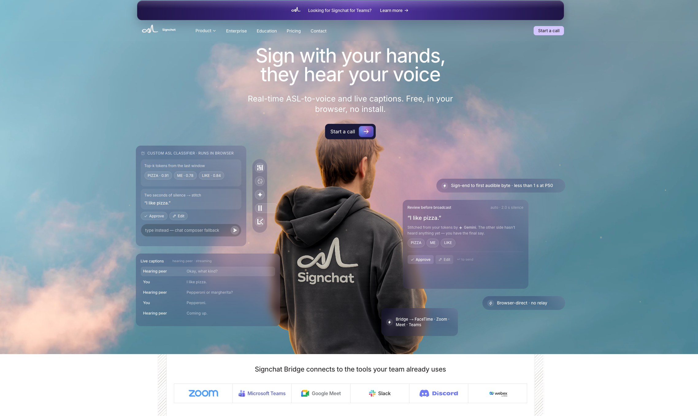

<div align="center">

# Signchat

### Finally hearing the side of the call that was silent.

**Real-time American Sign Language → voice video chat,<br/>running entirely in your browser, in about half a second.**

[](https://signchat.org)
[](#license)

#### [Try it now](https://signchat.org/start) &nbsp;·&nbsp; [Watch the 3-minute demo](https://www.youtube.com/watch?v=SENhVVNZQGY) &nbsp;·&nbsp; [Read the architecture](ARCHITECTURE.md)

</div>

---

## The problem

> About **500,000 Americans** speak ASL as their first language.
>
> The U.S. has roughly **10,000 certified ASL interpreters** — and almost all of them are scheduled into healthcare, legal, and government calls.

For everyday video calls — a friend, a family member, a coworker — the
Deaf side has been quietly left out, locked into a chat box while
everyone else is talking. _Imagine sitting in a video call where you
can't talk._ That's the everyday call for millions.

## What we built

A custom **250-sign classifier** runs locally in your browser. Recognized
signs are stitched into fluent English by a **fine-tuned LLM**. The
result is streamed back as **natural synthetic voice** — mixed with your
real microphone into one stable channel. The receiving person just hears
you talking.

> [!IMPORTANT]
> This is frontier-level work. Researchers have been chasing real-time
> ASL translation for years. We did it in a hackathon, in pure browser
> code, with **sub-second end-to-end latency** and **zero relay
> servers**.

## See it

> [!TIP]
> The fastest way to understand Signchat is to **[open it in a browser](https://signchat.org/start)** with a friend on the other side. The whole product is one URL.

<div align="center">

[](https://signchat.org)

**▶ [Watch the 3-minute demo on YouTube](https://www.youtube.com/watch?v=SENhVVNZQGY)**

</div>

| | |
| :--- | :--- |
| **Live app** | <https://signchat.org> |
| **3-minute demo** | <https://www.youtube.com/watch?v=SENhVVNZQGY> |
| **Architecture deep-dive** | [`ARCHITECTURE.md`](ARCHITECTURE.md) (17 sections) |

**What you'll see in the demo:**

- A real ASL signer signing into a webcam
- Recognized tokens appearing live, top-K with confidences
- A reconstructed sentence shown for review (Approve / Edit / Re-sign / Discard)
- Synthetic voice on the hearing peer's tile, with live captions on both sides

## How it works


Two browsers, three providers (LiveKit, OpenRouter, ElevenLabs), and one
small Vercel surface that only mints credentials. **Every per-turn hop
goes browser-direct** — no Signchat-operated relay, no server-side
LiveKit bot, no TTS gateway.

The full spec lives in **[`ARCHITECTURE.md`](ARCHITECTURE.md)** — 17
sections, mermaid diagrams render inline on GitHub.

## The numbers we're proud of

<div align="center">

| Metric | Value |
| :--- | :---: |
| **Sign-end → first audible byte** (P50, end-to-end) | **~0.6 s** |
| **Sign-end → first audible byte** (P95, end-to-end) | **~0.9 s** |
| **Vocabulary** | **250 signs** (PopSign / Kaggle ISLR) |
| **Model size** | **~1.7M params** (Conv1D + Transformer) |
| **Runtime** | **ONNX in WebAssembly** (no GPU required) |
| **Signchat-operated relay servers** | **0** |
| **`NEXT_PUBLIC_*` secrets in the browser** | **0** |
| **Fallback voices that fake a failed turn** | **0** |

</div>

## What's in this monorepo

### Apps

- **[`apps/web`](apps/web)** — Next.js 16 app: meeting UI, marketing
  pages, credential-mint API routes. The thing you load at signchat.org.
- **[`apps/bridge`](apps/bridge)** — Electron desktop companion that
  publishes a system-level `signchat-voice` virtual microphone for
  FaceTime, Zoom, Meet, Teams, and Discord. Same browser pipeline,
  routed as a mic.

### Packages

- **[`packages/sign-pipeline`](packages/sign-pipeline)** — MediaPipe and
  onnxruntime-web loaders, vocabulary fetcher, and the `admitToken`
  buffer admit logic.
- **[`packages/runtime-browser`](packages/runtime-browser)** — OpenRouter
  HTTP client, ElevenLabs WSS streaming, mode-controller FSM, and the
  Web Audio graph that publishes the `signchat-voice` track.
- **[`packages/prompts`](packages/prompts)** — frozen
  `LEAN_OPTIONS_SYSTEM` prompt, the request builder, and a Zod-validated
  response parser.
- **[`packages/contracts`](packages/contracts)** — shared sign /
  DataChannel / config types used across packages.

### Models, tooling, and docs

- **[`asl-classifier-model/`](asl-classifier-model)** — Python repo for
  the 250-sign Conv1D-Transformer classifier: configs, training, eval,
  RunPod orchestration scripts, per-run benchmark log.
- **[`prompt-tester-service/`](prompt-tester-service)** — model sweep
  harness; full results in
  [`charts/RESULTS.md`](prompt-tester-service/charts/RESULTS.md) (10
  models × 399 scenarios = 3,990 OpenRouter calls).
- **[`signchat-workbench/`](signchat-workbench)** — internal harness for
  landmark playback and classifier debugging.
- **[`ARCHITECTURE.md`](ARCHITECTURE.md)** — the canonical 17-section
  spec.

## Quick start

> [!NOTE]
> **Prerequisites:** Node **20.18+** and pnpm **10**. Use [`fnm`](https://github.com/Schniz/fnm) or [`nvm`](https://github.com/nvm-sh/nvm) so it picks up [`.nvmrc`](.nvmrc).

### 1. Install everything in the workspace

```bash
pnpm install
```

### 2. Add your provider keys

```bash
cp apps/web/.env.example apps/web/.env
```

Then fill in:

| Variable | Provider |
| :--- | :--- |
| `LIVEKIT_URL`, `LIVEKIT_API_KEY`, `LIVEKIT_API_SECRET` | LiveKit Cloud |
| `OPENROUTER_MANAGEMENT_API_KEY` | OpenRouter |
| `ELEVENLABS_API_KEY`, `ELEVENLABS_VOICE_ID` | ElevenLabs |

### 3. Run every workspace `dev` script in parallel

```bash
pnpm dev
# web → http://localhost:3000
```

To run only the web app:

```bash
pnpm --filter @signchat/web dev
```

To run the **Bridge** desktop app against a local web server:

```bash
VITE_SIGNCHAT_API_BASE=http://localhost:3000 \
  pnpm --filter @signchat/bridge dev
```

To train (or audit) the **classifier**:

```bash
cd asl-classifier-model
make help                                  # lists every Makefile target
make eval CKPT=pretrained/phase1_kaggle/   # local CPU-only eval
```

## Engineering choices that mattered

- **Admit-before-stitch.** Single-tick top-1 predictions are noisy. We
  only commit a label to the buffer when it's stable across ticks
  (_"stable"_) or top-1 with a credible top-2 contender (_"band"_).
  Lives in
  [`packages/sign-pipeline/src/admit.ts`](packages/sign-pipeline/src/admit.ts).
- **Review-before-broadcast UX.** The signer sees every reconstructed
  sentence before the hearing peer hears anything. Auto mode advances on
  a configurable silence; proofread mode requires Approve / Edit /
  Re-sign / Discard. **Errors stay loud.**
- **Bridge as a system mic.** Rather than build N integrations, we
  publish `signchat-voice` as a BlackHole-backed virtual microphone via
  Electron. Any app that picks a mic — FaceTime, Zoom, Meet, Teams,
  Discord — works today, with no SDK or extension.
- **Browser-direct, on purpose.** The deploy graph has zero Signchat
  servers on the per-turn path. That's an architecture choice (see
  [`ARCHITECTURE.md` §15.3](ARCHITECTURE.md#15-deployment-topology)),
  not an accident — it makes the privacy and cost story honest.
- **Data-driven model selection.**
  [`prompt-tester-service/`](prompt-tester-service) runs 10 models × 399
  scenarios each release. Lowest reliable reconstruction call we
  measured: **`openai/gpt-5.4-nano` at p50 = 236 ms, p95 = 486 ms**.
  Full report in
  [`prompt-tester-service/charts/RESULTS.md`](prompt-tester-service/charts/RESULTS.md).

---

<div align="center">

## Team

Built by **Adil & Nathan**.

</div>

---

## Acknowledgments

- Google Kaggle Isolated Sign Language Recognition (`asl-signs`)
  competition — **PopSign 250** dataset
- **MediaPipe Tasks Vision** for landmarking
- **ONNX Runtime Web** for in-browser inference
- **LiveKit Cloud** for the SFU and DataChannel
- **OpenRouter** for unified access to LLMs (Gemini, GPT, Mistral, …)
- **ElevenLabs** for streaming TTS and voice-to-text
- **Next.js**, **Electron**, **BlackHole**, **Phosphor Icons**

## License

**MIT.** The Signchat name and the `signchat-voice` device label are not
covered by the code license.
