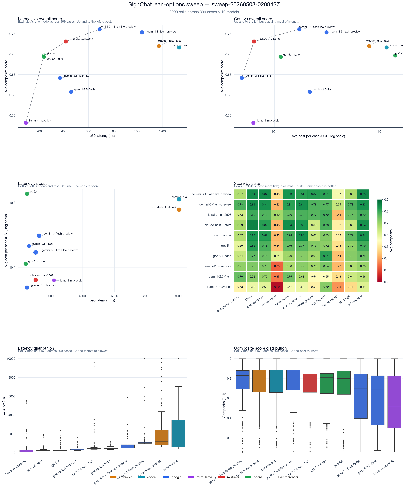
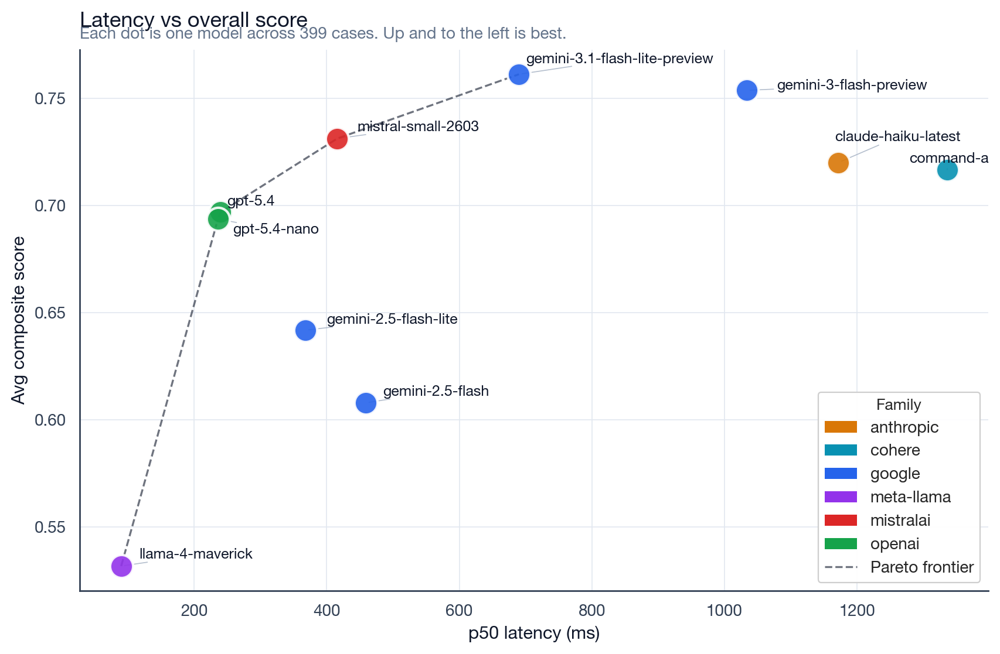
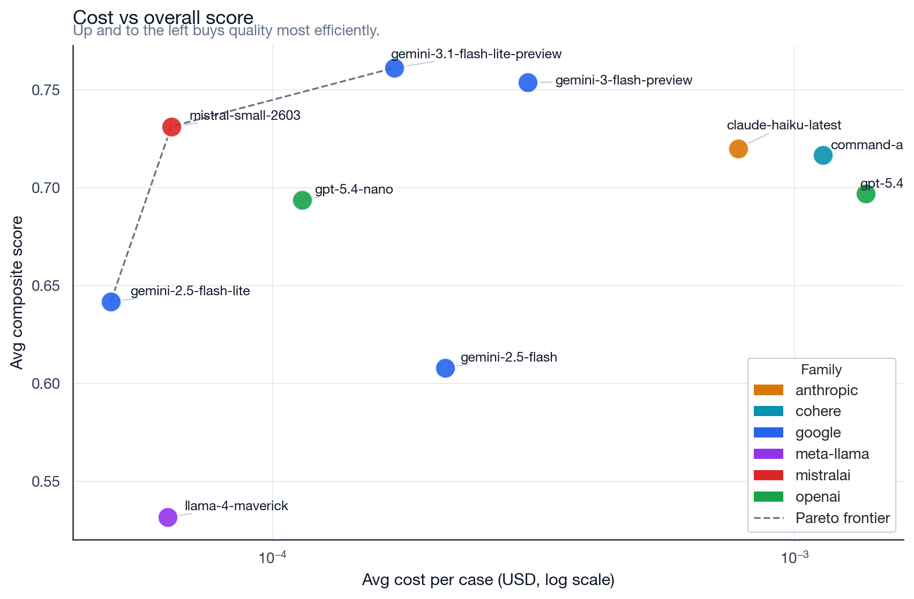
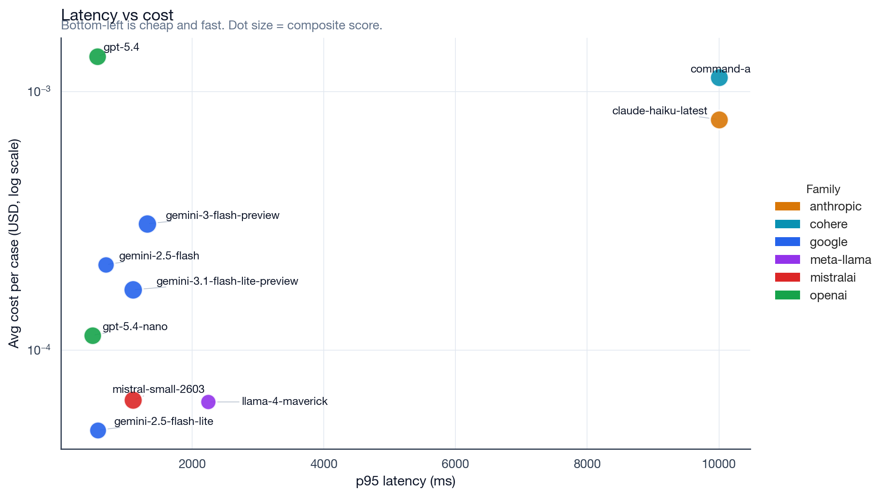
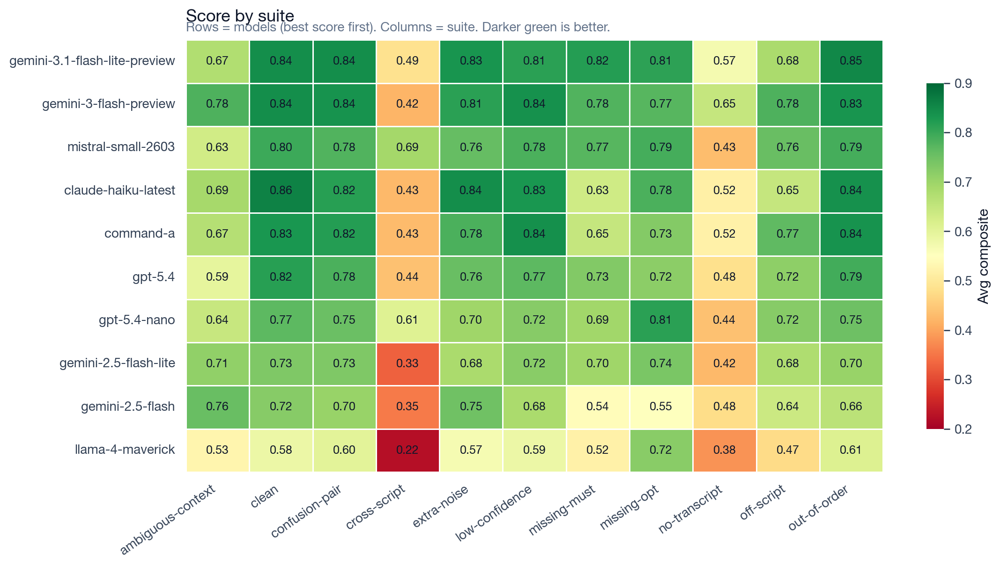
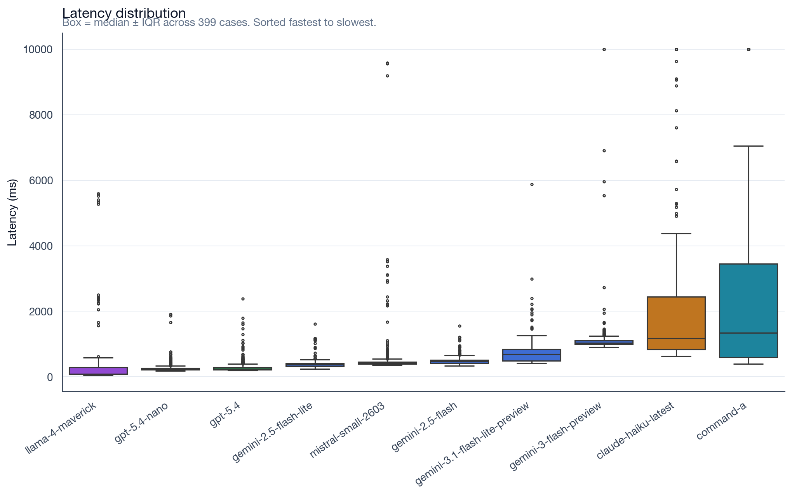
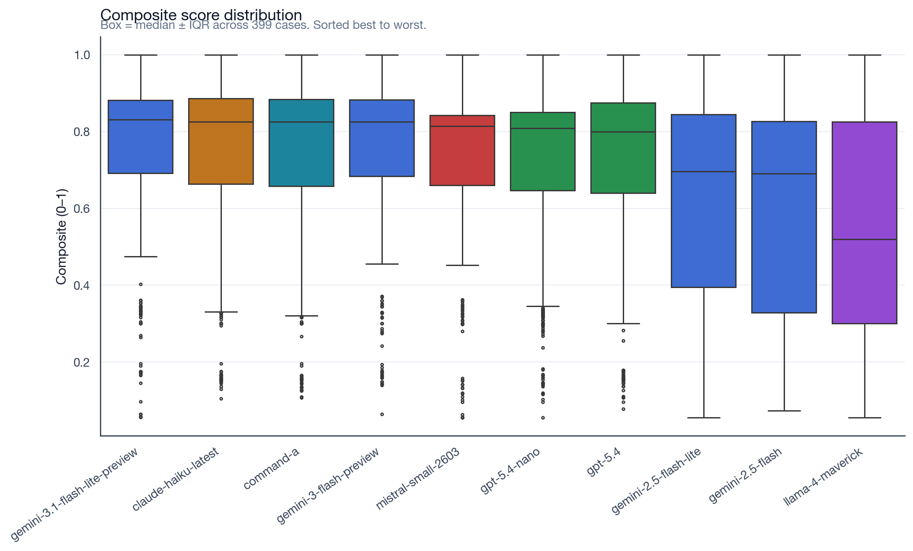
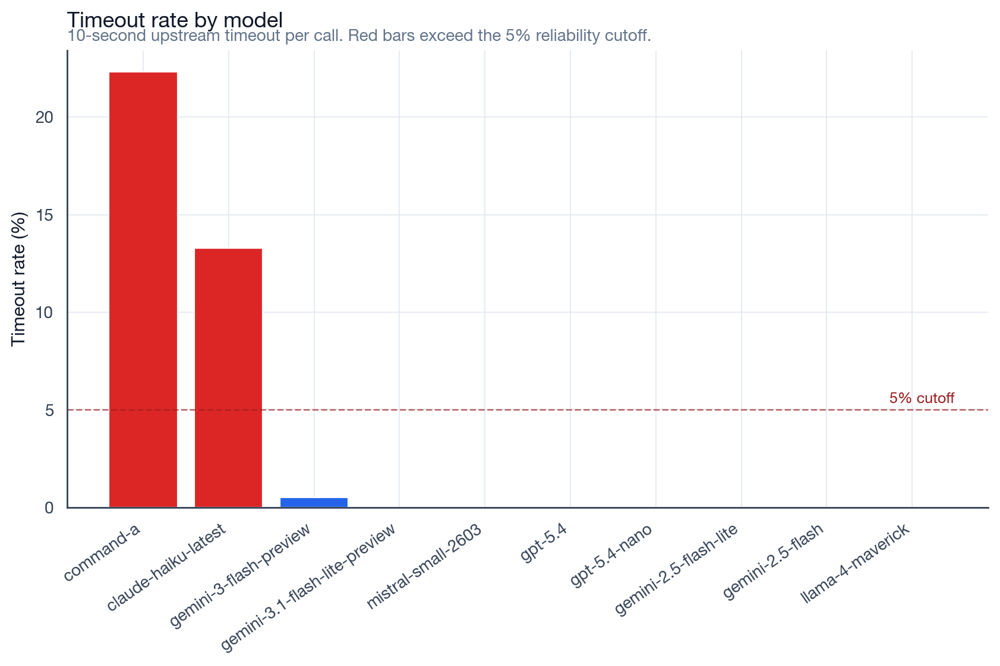

# Lean-options Model Sweep Results

**Run:** `sweep-20260503-020842Z` · **Strategy:** `lean-options` · **Scope:** 10 models × 399 scenarios = 3,990 OpenRouter calls.

## Executive summary

- **Best quality (composite):** `google/gemini-3.1-flash-lite-preview` at 0.761. Clean schema output, 98.5% under-2s, and naturalness 0.82.
- **Best value (cost × quality):** `mistralai/mistral-small-2603` at $0.000064/call and composite 0.731 — the only model on the score × cost Pareto frontier above a 0.70 quality floor.
- **Lowest reliable latency:** `openai/gpt-5.4-nano` with p50 = 236 ms, p95 = 486 ms, 100% under 2s. Good baseline but 8 points behind Gemini on composite.
- **Do not use in real-time:** `cohere/command-a` (22.3% timeout rate, p95 10003 ms) and `~anthropic/claude-haiku-latest` (13.3% timeout, p95 10002 ms). Both show good quality *when they respond* but miss the reliability bar.
- **Cheap but low quality:** `meta-llama/llama-4-maverick` — lowest composite (0.532) despite fast p50, driven by failures on `cross-script` (0.22) and `no-transcript` (0.38).

## Methodology

- **Strategy:** the `lean-options` prompt strategy only, as wired in [prompt-tester-service/lib/strategies.ts](../lib/strategies.ts).
- **Runner:** [prompt-tester-service/scripts/lean-options-sweep/run.ts](../scripts/lean-options-sweep/run.ts) with model concurrency 5, judge concurrency 3, per-call timeout 10 s.
- **Cases:** all 399 cases generated in [prompt-tester-service/lib/fixtures.ts](../lib/fixtures.ts) across 11 suites (clean, missing-must, missing-opt, extra-noise, out-of-order, low-confidence, no-transcript, confusion-pair, cross-script, off-script, ambiguous-context).
- **Scoring:** composite = `0.70·naturalness + 0.10·sentenceExact + 0.05·embeddingSim + 0.05·rouge1Recall + 0.05·signUsageRate + 0.05·jsonValid` — see [prompt-tester-service/lib/scoring.ts](../lib/scoring.ts). Judge is `openai/gpt-5.4-mini`, embeddings via `openai/text-embedding-3-large`.
- **Latency:** measured on the primary model call only, not including judge/embedding round trips.
- **Cost:** derived from OpenRouter model pricing at run time and realized token usage.

## Overview



## Quality vs latency



`gemini-3.1-flash-lite-preview` sits alone in the top-left ideal corner. The Pareto step (`llama-4-maverick → gpt-5.4-nano → gpt-5.4 → mistral-small-2603 → gemini-3.1-flash-lite-preview`) is the undominated set on score × p50 latency.

## Quality vs cost



Three models are Pareto-efficient on cost × score: `gemini-2.5-flash-lite` (cheapest), `mistral-small-2603` (best value above 0.7), and `gemini-3.1-flash-lite-preview` (best quality). `gpt-5.4` and `command-a` are dominated — similar quality at 8–20× the cost.

## Latency vs cost



Bottom-left is the real-time sweet spot. `gemini-2.5-flash-lite`, `mistral-small-2603`, `llama-4-maverick`, and `gpt-5.4-nano` all cluster under p95 ≤ 2.2 s and < $0.000114/call. `claude-haiku-latest` and `command-a` live in the top-right because their p95 is pinned at the 10 s timeout.

## Suite-by-suite robustness



- `cross-script` collapses every model (best cell: 0.69 Mistral). This suite deliberately pairs mismatched tokens/transcripts, so it's the right canary for contextual grounding.
- `no-transcript` exposes models that over-rely on hearing context: Mistral 0.43, Gemini-2.5-Flash 0.48, Claude 0.52.
- `ambiguous-context` separates careful reconstruction (Gemini 3-Flash 0.78) from shallow token regurgitation (Llama 0.53).

## Distributions





## Reliability



Red bars exceed the 5% operational cutoff. The 10 s upstream timeout is generous; the Anthropic and Cohere endpoints still failed on ~1 in 8 and ~1 in 5 calls respectively during the sweep.

## Model ranking table

Sorted by composite score (descending). "Status" summarizes recommended deployment posture.

| Model | Composite | Naturalness | Exact | Sign usage | p50 ms | p95 ms | Avg $ | Timeout | Status |
|---|---:|---:|---:|---:|---:|---:|---:|---:|---|
| `google/gemini-3.1-flash-lite-preview` | 0.761 | 0.823 | 20.8% | 86.2% | 690 | 1098 | $0.000171 | 0% | default pick |
| `google/gemini-3-flash-preview` | 0.754 | 0.800 | 23.9% | 92.1% | 1034 | 1315 | $0.000308 | 0.5% | premium alt |
| `mistralai/mistral-small-2603` | 0.731 | 0.847 | 3.8% | 74.2% | 416 | 1104 | $0.000064 | 0% | best value |
| `~anthropic/claude-haiku-latest` | 0.720 | 0.752 | 21.7% | 93.7% | 1172 | 10002 | $0.000779 | 13.3% | not real-time |
| `cohere/command-a` | 0.717 | 0.739 | 27.1% | 91.9% | 1336 | 10003 | $0.001133 | 22.3% | not real-time |
| `openai/gpt-5.4` | 0.697 | 0.714 | 27.3% | 90.7% | 240 | 563 | $0.001367 | 0% | priced out |
| `openai/gpt-5.4-nano` | 0.694 | 0.778 | 4.5% | 84.9% | 236 | 486 | $0.000114 | 0% | latency anchor |
| `google/gemini-2.5-flash-lite` | 0.642 | 0.675 | 13.8% | 85.1% | 368 | 567 | $0.000049 | 0% | low-quality floor |
| `google/gemini-2.5-flash` | 0.608 | 0.592 | 26.3% | 90.8% | 459 | 691 | $0.000214 | 0% | legacy |
| `meta-llama/llama-4-maverick` | 0.532 | 0.509 | 17.3% | 86.5% | 90 | 2241 | $0.000063 | 0% | fast but weak |

## Recommendations

- **Default pick:** `google/gemini-3.1-flash-lite-preview`. Highest composite, JSON-valid on 100% of calls, and sub-1.1 s p95 with ~$0.000171/call.
- **Production value choice:** `mistralai/mistral-small-2603`. Nearly identical composite at 37% of the cost and half the latency — accept the low exact-match rate because naturalness is higher than Gemini's.
- **Latency baseline:** `openai/gpt-5.4-nano` for any path that must guarantee sub-500 ms p95.
- **Benchmark upper bound:** `google/gemini-3-flash-preview` — 0.754 composite, but costs 4× Gemini-flash-lite and adds ~340 ms p50. Keep only for comparison runs.
- **Drop from real-time use:** `cohere/command-a`, `~anthropic/claude-haiku-latest`. Their timeout rates alone disqualify them; revisit when OpenRouter stabilizes the upstream.

## Failure mode highlights

- **Cross-script confusion.** Every model loses ≥ 30 composite points on `cross-script`. Llama-4-Maverick (0.22) and the Gemini 2.5 pair (0.33–0.35) are the worst; Mistral (0.69) is the most robust.
- **No-transcript degradation.** When the hearing transcript is blanked, Gemini-2.5-Flash drops to 0.48 and Mistral to 0.43 — both models over-fit to transcript context during normal runs. Gemini-3.1-flash-lite-preview still hits 0.57 here.
- **Schema shape.** Every model returned JSON-valid responses on every case. No need for response-healing at this scale.
- **Reliability tail.** Claude and Command timed out on a wide mix of suites (see [error-cases.json](../results/lean-options-sweep/sweep-20260503-020842Z/charts/error-cases.json)). Not suite-specific — more likely upstream saturation.

## Pareto frontiers

- **Max score × min p50 latency:** `meta-llama/llama-4-maverick` → `openai/gpt-5.4-nano` → `openai/gpt-5.4` → `mistralai/mistral-small-2603` → `google/gemini-3.1-flash-lite-preview`.
- **Max score × min avg cost:** `google/gemini-2.5-flash-lite` → `mistralai/mistral-small-2603` → `google/gemini-3.1-flash-lite-preview`.
- **Min latency × min cost (score ≥ 0.7):** `mistralai/mistral-small-2603` is the only undominated model.

## Artifact index

Charts (this directory):

- [overview.png](overview.png)
- [latency-vs-score.png](latency-vs-score.png)
- [cost-vs-score.png](cost-vs-score.png)
- [latency-vs-cost.png](latency-vs-cost.png)
- [exact-vs-naturalness.png](exact-vs-naturalness.png)
- [suite-heatmap-score.png](suite-heatmap-score.png)
- [suite-heatmap-latency.png](suite-heatmap-latency.png)
- [latency-boxplot.png](latency-boxplot.png)
- [score-boxplot.png](score-boxplot.png)
- [cost-boxplot.png](cost-boxplot.png)
- [timeout-bar.png](timeout-bar.png)

Underlying data:

- Run summary: [../results/lean-options-sweep/sweep-20260503-020842Z/run-summary.json](../results/lean-options-sweep/sweep-20260503-020842Z/run-summary.json)
- Per-model aggregates: [../results/lean-options-sweep/sweep-20260503-020842Z/charts/model-summary.json](../results/lean-options-sweep/sweep-20260503-020842Z/charts/model-summary.json)
- Per-suite cells: [../results/lean-options-sweep/sweep-20260503-020842Z/charts/suite-summary.json](../results/lean-options-sweep/sweep-20260503-020842Z/charts/suite-summary.json)
- Failures and low-score cases: [../results/lean-options-sweep/sweep-20260503-020842Z/charts/error-cases.json](../results/lean-options-sweep/sweep-20260503-020842Z/charts/error-cases.json)
- Raw per-case JSON (3,990 files): `../results/lean-options-sweep/sweep-20260503-020842Z/raw/`

## How to regenerate

```bash
# run the sweep (≈30 min on model concurrency 5)
cd prompt-tester-service/scripts/lean-options-sweep
npx tsx run.ts

# render charts (PNG + SVG)
./.venv/bin/python render_charts.py ../../results/lean-options-sweep/<run-id>
```

The Python venv and requirements live alongside the renderer in [prompt-tester-service/scripts/lean-options-sweep/](../scripts/lean-options-sweep/).
